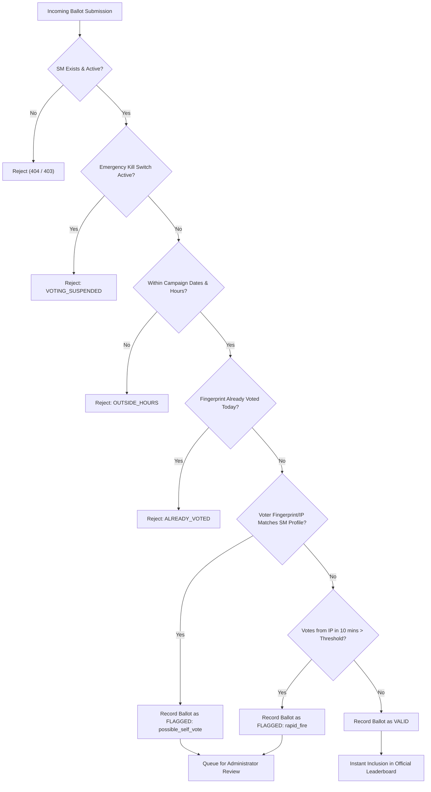

# Fraud Detection & Anti-Cheat Security Architecture

This document specifies the technical logic, cryptographic fingerprinting, and rule evaluation workflow designed to ensure voting integrity and prevent manipulation.

---

## 1. Threat Model & Mitigation Matrix

| Threat Vector | Attack Scenario | Mitigation Rule |
| :--- | :--- | :--- |
| **Self-Voting by SM** | Service Master scans their own badge repeatedly using personal smartphone | **Hardware Profile Match**: Compares voter fingerprint & IP against SM's calibrated device profile. |
| **Duplicate Voting** | Customer votes multiple times in the same day | **Cryptographic Fingerprint Deduplication**: Hashes canvas, screen, timezone, platform to enforce 1 vote/day. |
| **Rapid-Fire Scripting** | Bot or automated script floods submissions from a single machine | **Sliding Window IP Velocity**: Caps votes to max 5 votes per 10 minutes per IP. Excess is flagged. |
| **Off-Hours Stuffing** | Colluding staff casts ballots late at night after station closure | **Operating Hours Boundary**: Only permits ballot submission during designated shift windows (e.g. 06:00 - 22:00). |
| **Emergency Disruption** | Disputed results, server maintenance, or station anomaly | **Instant Kill Switch**: Halts voting across all QR codes within 0ms. |

---

## 2. Voter Cryptographic Fingerprinting

Rather than requiring intrusive customer registration (such as collecting phone numbers or national IDs), the system creates a non-invasive, high-entropy cryptographic hash:

$$\text{Fingerprint} = \text{SHA-256}\Big(\text{ScreenResolution} \parallel \text{ColorDepth} \parallel \text{Timezone} \parallel \text{Language} \parallel \text{HardwareConcurrency} \parallel \text{UserAgent} \parallel \text{CanvasEntropy}\Big)$$

- **Canvas Entropy**: Uses HTML5 Canvas rendering of unique alpha blending, font kerning, and color transforms that vary based on GPU hardware and graphics drivers.
- **Privacy Assurance**: The hash is irreversible. No personally identifiable information (PII) is stored or transmitted, adhering strictly to the **Data Privacy Act of 2012** and **GDPR principles**.

---

## 3. Fraud Engine Evaluation Sequence

When a ballot is received at `POST /api/vote`, the server evaluates the payload through the following pipeline:

---

## 4. Configurable Rules in Admin Panel

Administrators can adjust these security parameters without restarting the application:

1. **Operating Hours**:
   - `enforce_operating_hours`: Boolean toggle
   - `operating_hours_start`: e.g. `06:00`
   - `operating_hours_end`: e.g. `22:00`
2. **Rapid-Fire Threshold**:
   - `rapid_fire_minutes`: Default `10` minutes
   - `rapid_fire_max_votes`: Default `5` votes
3. **Duplicate Window**:
   - `daily`: 1 vote per 24-hour cycle (midnight reset)
   - `campaign`: 1 vote for the entire month
4. **Kill Switch**: Instant boolean override.
5. **Test Mode**: Toggles test tagging (`is_test: true`) to verify setup.
